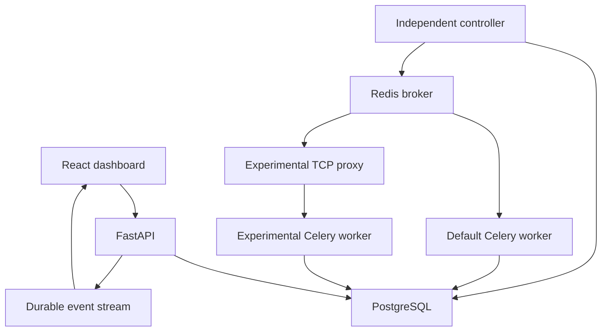
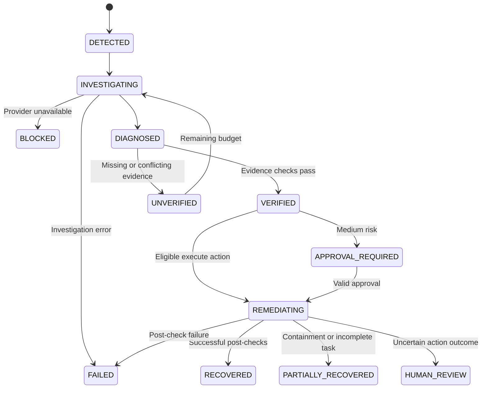
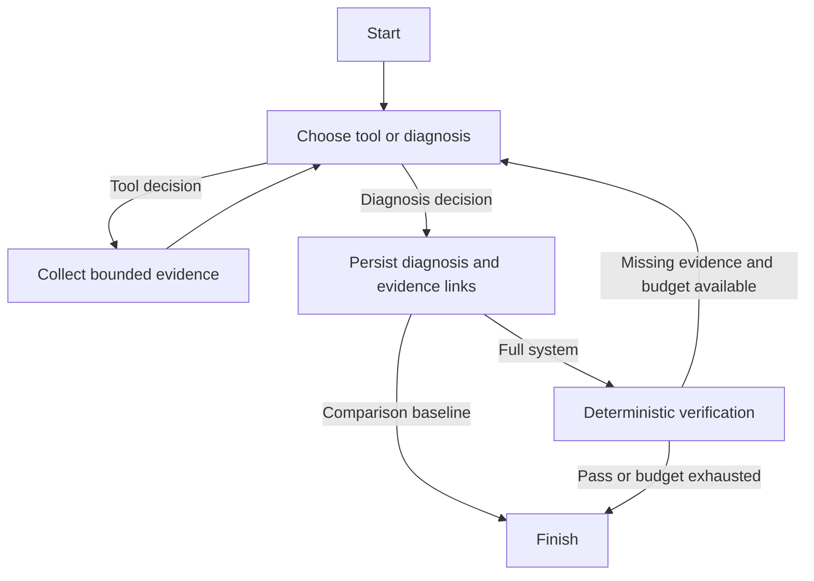
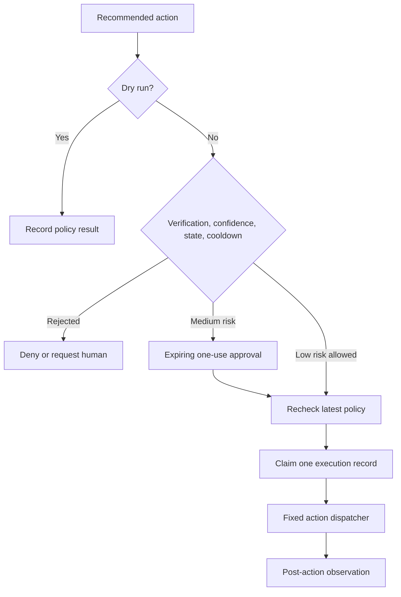
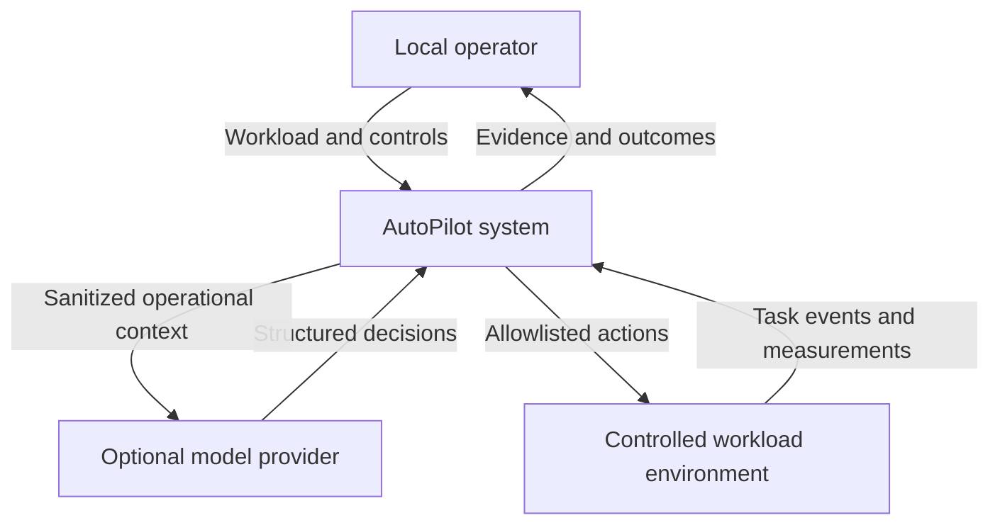
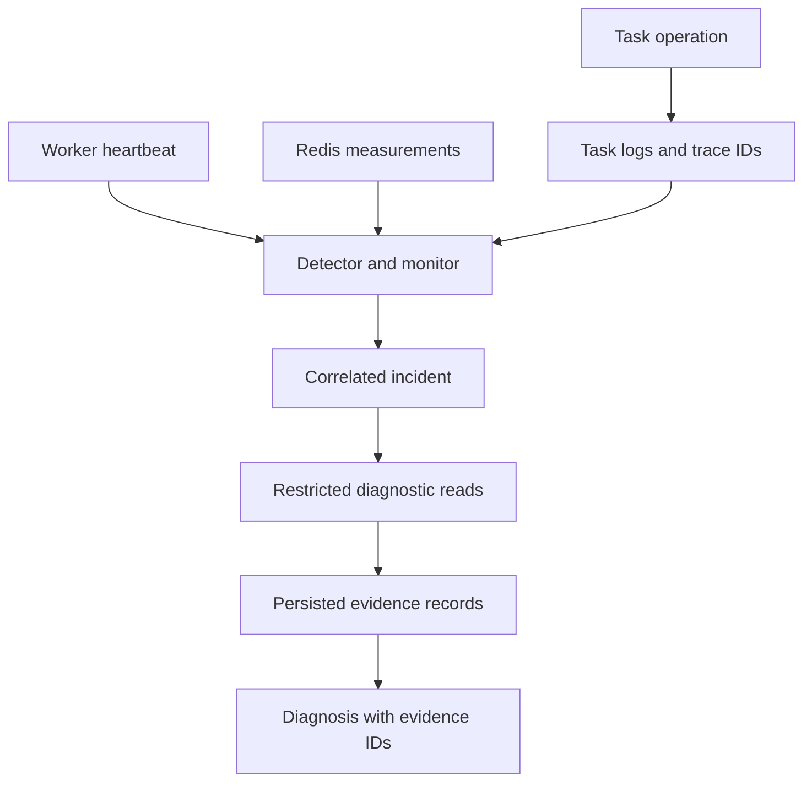
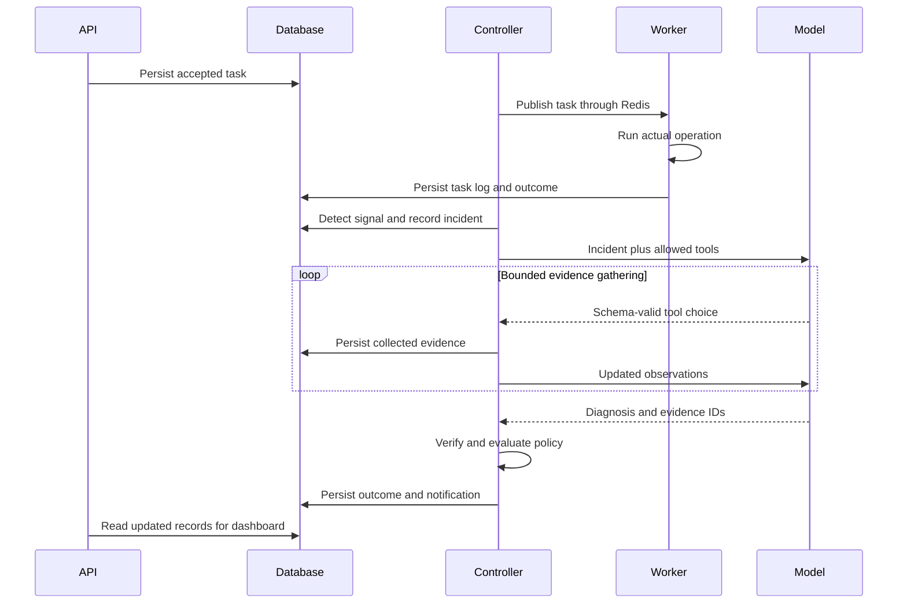
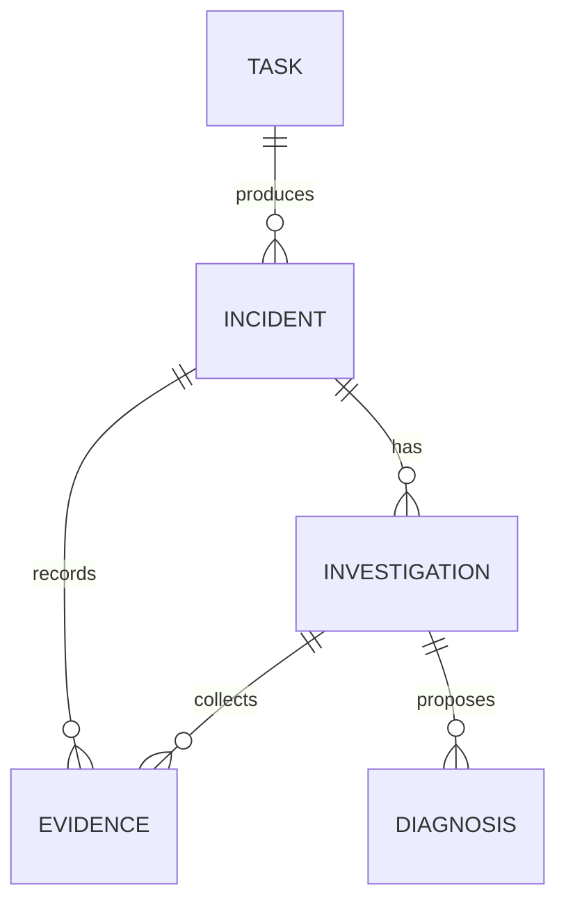
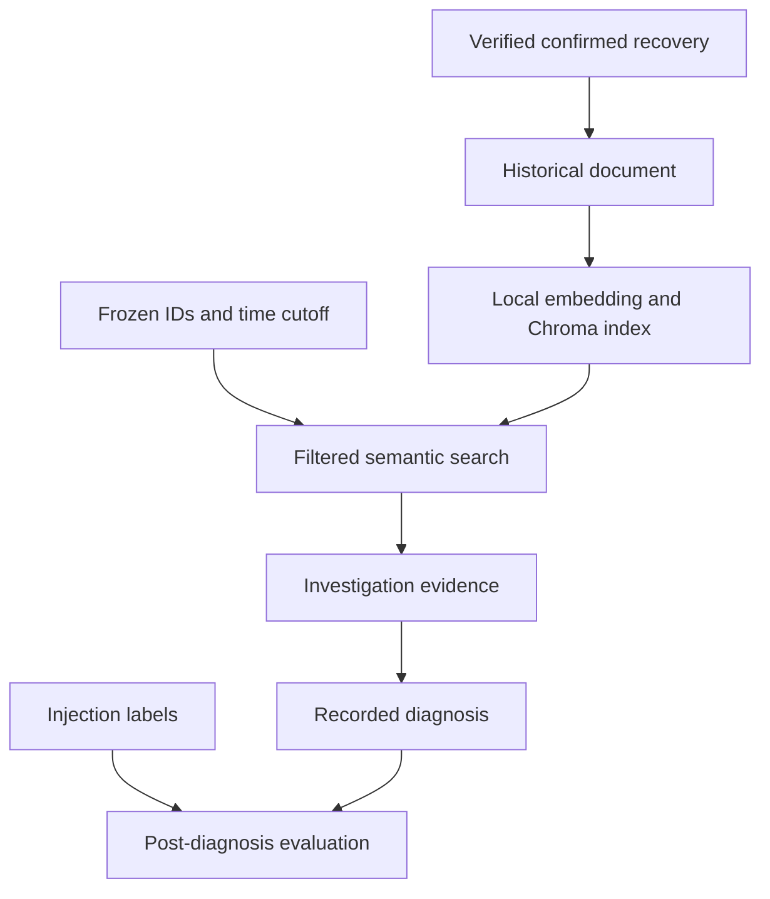

# Architecture and design

## 1. Runtime components

The controller has independent loops for dispatch, fault control, monitoring, investigation, remediation, indexing, and experiments. A session-level PostgreSQL advisory lock prevents multiple active controller processes. The API and workers do not require the controller's Python thread to accept a new request; accepted tasks remain durable until dispatch resumes.

## 2. Incident lifecycle

Baseline configurations may stop at DIAGNOSED. Dry-run policy records do not create an execution or mark the incident recovered. Restarted investigations become INTERRUPTED and are not resumed from invented model state.

## 3. Actual LangGraph topology

`InvestigationRunner.graph()` compiles this graph. Each model decision is validated with `AgentDecision`. Tools are removed from the allowed set when the call/step budget is reached. Verification feedback is public, structured evidence feedback, not hidden reasoning. RULE_BASED bypasses the model graph and executes a fixed evidence pass.

## 4. Policy and execution gate

The model cannot supply arbitrary execution parameters. The server derives task, queue, and worker targets from the incident. A unique execution constraint and a committed EXECUTING claim prevent the controller from replaying an uncertain operation after a crash. This deliberately prefers human review over assuming an external action did not happen.

## 5. Context data-flow diagram

Model-provider requests can send sanitized operational logs/code excerpts outside the machine when a hosted provider is selected. Redaction limits common credential fields and patterns but is not a general-purpose DLP guarantee. Use local Ollama or carefully scoped test inputs when that matters. No secrets are put in frontend environment variables.

## 6. Operational evidence data flow

Incident fingerprints include scope, component, signal kind, queue, and worker context where available. Signals within the configured correlation window update the existing incident's occurrence count and append events. A detection receipt prevents the same error log being consumed repeatedly. Different signal kinds may still generate related separate incidents; this is not an unlimited semantic event-correlation engine.

## 7. End-to-end sequence

Workers persist directly to PostgreSQL. The HTTP model calls are optional and never used by the rule baseline. Redis is omitted as a participant to keep this diagram focused on evidence order.

## 8. Core evidence relationships

Additional normalized relationships are explicit in SQLAlchemy/Alembic:

| Record | Relationship |
|---|---|
| DiagnosisEvidence | Diagnosis, evidence, and supporting/contradicting role |
| Verification | Diagnosis plus checks, contradictions, missing evidence, score |
| Remediation | Incident and unique diagnosis; action, bound targets, policy, mode |
| ApprovalRequest | Unique remediation; decision, actor, expiry |
| RemediationExecution | Unique remediation; action result, observation time, post-result |
| HistoricalIncident | Unique incident and verified diagnosis; indexed document |
| ExperimentRun | Experiment, configuration, scenario, trial; immutable setup snapshot |
| ExperimentMetric | Unique run and measured evaluator values |
| FaultInjection | Private evaluation scope, actual activation/reset time, optional run |
| LLMUsage | Per actual provider request, including invalid outputs and failures |
| StreamEvent | Monotonic durable notification cursor for WebSockets |

## 9. Retrieval and evaluation boundary

There is no label-to-agent path. The operator UI can show evaluation labels because the operator administers the local experiment. They are excluded from the diagnostic capability set and source root.

## Failure and storage semantics

Celery/Redis delivery is at least once. A durable dispatch row, idempotency key, bounded retries, delivery cap, and per-task operation receipts reduce duplicate side effects; they do not create a universal exactly-once guarantee. See the [Celery task guide](https://docs.celeryq.dev/en/stable/userguide/tasks.html) for late-acknowledgement and worker-loss semantics.

The default worker uses direct Redis connectivity; the experiment worker uses a fixed TCP proxy. The supervisor accepts only crash/restart of its own fixed child command. It has no Docker socket, arbitrary command endpoint, or selectable process ID.

Task artifacts, PostgreSQL, Redis AOF, Chroma, embedding cache, Grafana, and Prometheus use named volumes. Jaeger's default trace storage and the dependency's observation ring are ephemeral. PostgreSQL task/incident/evidence records remain the durable source of truth. No retention purge is silently applied to research records; plan retention before prolonged runs.

The graph uses the documented [LangGraph graph API](https://docs.langchain.com/oss/python/langgraph/graph-api). Local embeddings follow the [Chroma Sentence Transformers integration](https://docs.trychroma.com/integrations/embedding-models/sentence-transformer) concept, with an explicit service boundary and server-side history filters.
